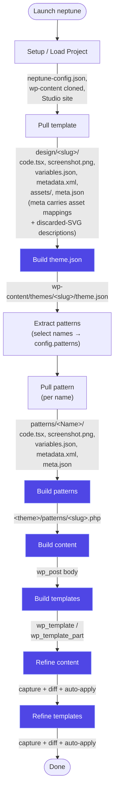

# Neptune

Neptune is an interactive CLI that turns Figma designs into working WordPress block themes. It pulls a page from Figma (Tailwind TSX + variables + screenshot), runs a local WordPress site under [Studio](https://developer.wordpress.com/studio/), and uses the Claude Agent SDK to convert each pull into Gutenberg block markup, a `theme.json`, and any block style variations the design needs. Refinements happen by capturing the live render, diffing it against the design, and applying only the differences.

The intent is to keep the human at the menu — Neptune drives Figma, the file system, the Studio site, and the agents. Failures stop early and surface in the UI, so a paid agent call only fires when its inputs are good.

## Install

```bash
git clone <this repo>
cd neptune
npm install
npm run build
node dist/cli.js
```

You'll also need:

- Studio for Mac/Windows running, with at least one site created (for local WP).
- Figma's MCP server enabled (the plugin pulls TSX, assets, dev notes via MCP).
- An Anthropic API key for the Claude Agent SDK.
- [Haydi](https://github.com/Automattic/haydi) installed on the Studio site, with `haydi-full-extensions.zip` enabled. The setup wizard captures the site URL automatically; you paste the Bearer token from WP Admin → Haydi → Remote Access. Every build / refine / pattern command persists through Haydi MCP, so the token is required before any agent-driven write.

## What it does

The menu is grouped into Figma → Styles → Patterns → Content → Templates → End-to-end, matching the order you'd typically work through a project.

| Step                 | What you do                                                                                        | What Neptune does                                                                                                                                                                                                                                                                                                                                                                                                                                                                                                                                                                                                                                                                                                                                                                                                   |
| -------------------- | -------------------------------------------------------------------------------------------------- | ------------------------------------------------------------------------------------------------------------------------------------------------------------------------------------------------------------------------------------------------------------------------------------------------------------------------------------------------------------------------------------------------------------------------------------------------------------------------------------------------------------------------------------------------------------------------------------------------------------------------------------------------------------------------------------------------------------------------------------------------------------------------------------------------------------------- |
| Setup / Load Project | Pick a folder, name the project, point at the WordPress repo                                       | Initialises `neptune-config.json`, clones `wp-content`, creates the Studio site                                                                                                                                                                                                                                                                                                                                                                                                                                                                                                                                                                                                                                                                                                                                     |
| Pull template        | Select a frame in Figma, fill in the page name + WP template file (`index.html`, `header.html`, …) | Asks Figma's MCP for `code.tsx`, `screenshot.png`, `variables.json`, `metadata.xml`, dev notes; writes `design/<slug>/`. Downloads every `const imgFoo = "http://localhost:3845/..."` ref into `design/<slug>/assets/`, runs the SVG-triage agent over the SVG subset to classify content (logo / illustration / content icon — rasterized to PNG) vs. decoration (divider / ornament / gradient — discarded with a 1-sentence description), then imports every kept raster into the WP media library. Each upload's `constName → {id, url}` plus every discarded `constName: <description>` is persisted in `meta.json` so the build / refine agents can resolve image refs and pick structural replacements for discards. When `usesPostContent` is set, also ensures the target `wp_post` (page or post) exists. |
| Verify screenshots   | —                                                                                                  | Re-renders each design and re-captures so you know the source-of-truth screenshot still matches what Figma gives you                                                                                                                                                                                                                                                                                                                                                                                                                                                                                                                                                                                                                                                                                                |
| Build theme.json     | —                                                                                                  | Merges every pull's `variables.json` into `variables/all-variables.json`, then asks the `theme-json` skill to map tokens onto a block-theme `theme.json`                                                                                                                                                                                                                                                                                                                                                                                                                                                                                                                                                                                                                                                            |
| Extract patterns     | —                                                                                                  | Scans every pull's `code.tsx` for non-default top-level functions, presents a checkbox list of unique names, persists your selection to `config.patterns`                                                                                                                                                                                                                                                                                                                                                                                                                                                                                                                                                                                                                                                           |
| Pull pattern         | Pick a pattern from your config, select its Figma frame, press Enter                               | Pulls the four Figma artifacts into `patterns/<Name>/`. R re-reads the Figma selection from the picker; rows already pulled show as `(pulled)`.                                                                                                                                                                                                                                                                                                                                                                                                                                                                                                                                                                                                                                                                     |
| Build patterns       | Toggle off any patterns you don't want (every row starts checked)                                  | For each `patterns/<Name>/code.tsx`, runs the `tsx-to-pattern` skill (with the pattern's screenshot, theme.json, variables, and existing variations inventory) and writes `<theme>/patterns/<kebab-slug>.php`                                                                                                                                                                                                                                                                                                                                                                                                                                                                                                                                                                                                       |
| Build contents       | Toggle off any pulls you don't want                                                                | For each `usesPostContent` pull, sends `code.tsx`, `theme.json`, variables, screenshot, dev notes, existing block style variations, and the per-pull media library mappings (constName → id/url for uploads + descriptions for discarded SVGs) to the `tsx-to-blocks` skill; writes the `data-neptune-annotations="post-content"` subtree as the body of the matching `wp_post` (page)                                                                                                                                                                                                                                                                                                                                                                                                                              |
| Refine contents      | Toggle off any pulls you don't want                                                                | For each `usesPostContent` pull, captures the live page in headless Chromium, diffs against `screenshot.png` with [odiff](https://github.com/dmtrKovalenko/odiff), runs the `visual-diff` skill scoped to the post-content body, then `apply-diff` to update the page. Auto-approves every diff.                                                                                                                                                                                                                                                                                                                                                                                                                                                                                                                    |
| Build templates      | Toggle off any pulls you don't want                                                                | For each non-content-only pull, sends the same context to `tsx-to-blocks` and writes the resulting block markup into the `wp_template` / `wp_template_part` row. `usesPostContent` pulls emit a wrapper around a `wp:post-content` placeholder.                                                                                                                                                                                                                                                                                                                                                                                                                                                                                                                                                                     |
| Refine templates     | Toggle off any pulls you don't want                                                                | Same capture/diff/apply pipeline as Refine contents but against the wrapper template's `wp_template` / `wp_template_part`                                                                                                                                                                                                                                                                                                                                                                                                                                                                                                                                                                                                                                                                                           |
| View template diff   | Pick a pull                                                                                        | Re-runs only the capture+odiff step so you can inspect drift without paying for an agent call                                                                                                                                                                                                                                                                                                                                                                                                                                                                                                                                                                                                                                                                                                                       |
| End-to-end build     | Confirm                                                                                            | Runs the full pipeline in order — `theme.json → patterns → content → templates → refine content → refine templates` — auto-approving every diff. Reports total tokens, USD cost, and runtime at the end.                                                                                                                                                                                                                                                                                                                                                                                                                                                                                                                                                                                                            |
| Capture screens      | —                                                                                                  | After a build, captures every non-special pull's live page URL as a JPEG so you have share-ready snapshots without re-running the refine diff pipeline. No agent calls.                                                                                                                                                                                                                                                                                                                                                                                                                                                                                                                                                                                                                                             |

## User flow



The arrows are forward-only because each step is gated on the previous step's artefact landing on disk or in the database — `listPulls()` reads `design/<slug>/meta.json`, the menu reads `neptune-config.json`, and the build commands check for `themeSlug` before showing up. **End-to-end build** runs all six "build / refine" stages in this order in one shot, aggregating token totals and USD cost across every agent call.

## Architecture

Neptune is a small Ink (React-in-the-terminal) app that orchestrates five kinds of side effects: Figma MCP calls, file system writes, Studio's `wp-cli` MCP (asset upload only), Haydi MCP (database writes — wired into the agent SDK so the model persists its own work), and direct host-side Haydi REST (preflight + post-flight verification). Each command is a self-contained `runX(...)` async function — the React component is a thin shell around it.

```
source/
  app.tsx                       Top-level menu, project-state machine
  cli.tsx                       Entry point, argv parsing
  commands/
    setup-project/              Multi-step config wizard (project name → git repo → theme → WP install → wp-content clone → Studio site → Haydi token)
    pull-template.tsx           Pull template UI shell
    pull-template/              Pull template internals — picker-view (Figma node), configure-view (canonical mapping + title cards), gate-view, canonical-targets.ts (template-file ↔ slug/title/postType table), index.tsx (orchestration: Figma fetch → assets-fetch → svg-triage → media import → ensure wp_post via Haydi)
    pull-pattern.tsx            Figma node → patterns/<Name>/
    build-theme-json.tsx        variables → theme.json
    build-template.ts           Headless runBuild helper (used by build-templates.tsx)
    build-templates.tsx         Build templates picker UI — toggles a deselectable list, runs runBuild per row
    build-content.ts            Headless runBuildContent helper
    build-contents.tsx          Build contents picker UI — runs runBuildContent per row
    build-pattern.ts            Headless runBuildPattern helper
    build-patterns.tsx          Build patterns picker UI — toggles a deselectable list, runs runBuildPattern per row
    refine-template.ts          Headless runDiagnose / runApply helpers
    refine-templates.tsx        Refine templates picker UI — capture + odiff + agent fixes per row
    refine-content.ts           Headless runDiagnoseContent / runApplyContent helpers
    refine-contents.tsx         Refine contents picker UI
    extract-patterns.tsx        Selection UI — discovers candidate names, persists to config.patterns
    extract-patterns-parse.ts   Brace-matching scanner for top-level functions in code.tsx
    e2e.tsx                     End-to-end orchestrator — runs every build/refine stage and aggregates usage
    e2e-prereqs.ts              Prereq check used by the e2e UI (every selected pattern is pulled, etc.)
    verify-screenshots.tsx      Re-capture-and-diff against the source-of-truth screenshot
    view-template-diff.tsx      Capture + odiff with no agent call
    capture-screens.tsx         Headless JPEG capture of every non-special pull's live URL (share-ready snapshots, no agent calls)
  lib/
    agent-stream.ts             Claude Agent SDK driver; emits a structured `usage` LogEvent per call
    event-list.tsx              Streaming event list renderer
    sectioned-menu.tsx          Top-level menu with non-selectable section headers
    multi-select.tsx            Checkbox list (used by every "toggle off what you don't want" picker)
    menu.tsx                    Single-pick menu
    build-envelope.ts           Lenient JSON parser used by the visual-diff diagnose phase (the only remaining envelope-shaped agent response — the host needs structured diffs for the user-approval UI)
    theme-json-patch.ts         Read helpers + types for theme.json + block style variations (writes are agent-driven, on disk, via pull-writer Recipes 6 and 7)
    patterns.ts                 Pattern slug + on-disk discovery; `listPatternSources` reads patterns/&lt;Name&gt;/code.tsx, `listRegisteredPatterns` surfaces patterns the agent can `wp:pattern`-reference
    haydi-mcp.ts                Haydi MCP server descriptor for the agent SDK + the tool allowlist build/refine/pattern subagents are scoped to
    browser-capture.ts          Playwright headless capture (PNG for diffing, JPEG for share-ready snapshots)
    svg-rasterize.ts            Chromium-based SVG → PNG rasterizer used by SVG triage
    odiff-runner.ts             Pixel diff
    png-pad.ts                  PNG canvas-pad helper used by template-diff
    template-diff.ts            Pad + diff orchestration
    asset-mappings.ts           Formats the `=== media library mappings ===` prompt section (mapped + discarded) for build / refine agents
    wp-templates.ts, wp-pages.ts   Pure target builders (TemplateTarget / PageTarget) — runtime read/write goes through Haydi
    wp-cli.ts                      Thin Studio MCP wp-cli wrapper (asset upload only; build/refine writes use Haydi)
    validators.ts               Slug / URL / token validation helpers used by setup-project and Haydi callers
    design-walk.ts              Pull discovery / metadata
    build-variables.ts          variables/* merge
    dev-annotations.ts          Designer notes extraction
    atomic-write.ts             tmp-file-then-rename writes
  integrations/
    figma/
      mcp.ts                    Figma MCP session, get_code / get_screenshot / get_metadata / get_variable_defs
      assets-fetch.ts           Downloads every `const imgFoo = "http://localhost:3845/..."` ref from code.tsx into design/&lt;slug&gt;/assets/, tagging each as `raster` or `svg`
      svg-triage.ts             Rasterizes candidate SVGs and runs the triage agent (vision) to classify each as keep (rasterize → upload) vs. discard (decoration); returns kept assets plus a `DiscardedAsset[]` record carrying constName + 1-sentence description
      handoff-parse.ts          Parses Figma metadata.xml for title cards
      pull.tsx                  React UI driving an in-progress pull
    studio/
      mcp.ts                    Studio MCP session, wp-cli passthrough
      site.ts                   Studio site detection / URL resolution
      media-import.ts           Single-file `wp media import` via Studio wp-cli
      pull-asset-upload.ts      Uploads pulled rasters (and rasterized SVGs) to the WP media library, returns the `PulledAsset[]` mapping persisted in meta.json
    haydi/
      client.ts                 Direct JSON-RPC HTTP client for host-side Haydi calls (preflight extension check, post-flight read-back, idempotent ensure/read/write of templates + pages, theme.json cache flush). Bypasses the SDK — the agent talks to Haydi via MCP, the host talks to Haydi via this client.
    wordpress/                  WordPress install, wp-content clone
  plugins/neptune-tools/
    skills/
      tsx-to-blocks/SKILL.md    Source-of-truth prompt for the build agents
      tsx-to-pattern/SKILL.md   Source-of-truth prompt for the build-patterns agent
      apply-diff/SKILL.md       Source-of-truth prompt for the refine agent
      visual-diff/SKILL.md      Source-of-truth prompt for the diff agent
      theme-json/SKILL.md       Source-of-truth prompt for theme.json builder
```

Key invariants the codebase enforces:

- **Project state lives on disk, not in memory.** `neptune-config.json` is the source of truth for "what's been set up," and `design/<slug>/meta.json` is the source of truth for "what's been pulled." The menu reads these on every refresh; nothing is cached across runs.
- **Atomic writes everywhere.** Every file write goes through `lib/atomic-write.ts` (`writeFileAtomic`), which writes to a tmp file in the same directory and renames into place. A killed process never leaves a half-written `theme.json`.
- **Agents persist their own work via Haydi MCP + Edit / Write.** Every build / refine / pattern command attaches a [Haydi](https://github.com/Automattic/haydi) MCP server (`source/lib/haydi-mcp.ts`) and tells the agent which pull-writer recipe to follow. The agent writes the wp_template / wp_template_part / page / post post via `haydi_run_php`, edits `theme.json` freeform via `Read` + `Write`, registers block style variation files via `Write`, and flushes the cache via `haydi_run_php`. The host post-flight-verifies via direct Haydi REST and reports the size.
- **Existing block style variations are inventoried and reused.** Before each build/refine, Neptune reads `<theme>/styles/blocks/*.json` and feeds the inventory to the agent. If a header and footer need the same alternate button style, they share one `is-style-neptune-<slug>` instead of registering it twice.
- **Visual-diff diagnose still emits JSON** — the host needs structured per-diff entries for the user-approval UI (checkbox table during refine). Apply-diff is the agent-driven path: the user approves a subset, then `apply-diff` runs and persists via the same pull-writer recipes the build commands use, reporting `APPLIED <id>: …` / `SKIPPED <id>: …` summary lines.
- **Every paid path has a confirm-overwrite gate.** Build / refine commands check the database for an existing row first and prompt before overwriting, so a misclick can't burn an agent call you didn't mean to make.
- **Image refs are resolved at pull time, not build time.** Asset download, SVG triage (a vision-based classify-agent call), rasterization, and `wp media import` all happen inside `Pull template`. Build / refine agents never see Figma's `localhost:3845` URLs — they receive a finished `=== media library mappings ===` section listing both mapped uploads (`constName → id, url`) and discarded SVGs with a 1-sentence description of what each was, so structural replacements for decoration (border / `wp:separator` / background / drop / `wp:html`) don't require re-deriving intent from `code.tsx` alone.
- **Two annotation namespaces, separate purposes.** `data-development-annotations` carries non-binding designer notes (see `lib/dev-annotations.ts`) surfaced to the agent as `=== dev annotations ===`. `data-neptune-annotations` carries the semantic build directives the build skill consumes — see [Annotation vocabulary](#annotation-vocabulary) for the full table.

## Data flow: Figma → blocks

```mermaid
flowchart LR
    subgraph Figma
        F1["Frame node URL"]
    end

    subgraph Local["Local filesystem"]
        D1["design/&lt;slug&gt;/code.tsx"]
        D2["design/&lt;slug&gt;/screenshot.png"]
        D3["design/&lt;slug&gt;/variables.json"]
        D4["design/&lt;slug&gt;/meta.json"]
        V["variables/<br/>all-variables.json"]
        PT["patterns/&lt;Name&gt;/<br/>code.tsx, screenshot.png,<br/>variables.json, metadata.xml,<br/>meta.json"]
    end

    subgraph Theme["Theme files"]
        TJ["theme.json"]
        BS["styles/blocks/<br/>neptune-*.json"]
        PP["patterns/<br/>&lt;slug&gt;.php"]
    end

    subgraph DB["WordPress DB (via Studio)"]
        WT["wp_template /<br/>wp_template_part"]
        WP["wp_post"]
    end

    subgraph Agents["Agent skills"]
        TT["tsx-to-blocks"]
        TP["tsx-to-pattern"]
        TJB["theme-json"]
        VD["visual-diff"]
        AD["apply-diff"]
    end

    F1 -->|"Figma MCP"| D1
    F1 -->|"Figma MCP"| D2
    F1 -->|"Figma MCP"| D3
    F1 -->|"pull metadata"| D4
    D1 -->|"asset URL refs<br/>(localhost:3845)"| AF["assets-fetch<br/>(downloads → design/&lt;slug&gt;/assets/)"]
    AF -->|"SVG candidates"| TR["svg-triage agent<br/>(vision)"]
    AF -->|"rasters"| MI["pull-asset-upload<br/>(wp media import)"]
    TR -->|"kept → PNG"| MI
    TR -->|"discardedAssets[]<br/>(constName + description)"| D4
    MI -->|"constName → {id, url}"| D4
    D4 -->|"=== media library mappings ==="| TT

    D3 -->|"build-variables<br/>first-write-wins merge"| V
    V --> TJB
    TJB -->|"full theme.json"| TJ

    D1 --> TT
    D2 --> TT
    D3 --> TT
    TJ --> TT
    BS -->|"existing variations<br/>inventory (reuse)"| TT
    TT -->|"haydi_run_php<br/>(template post)"| WT
    TT -->|"Read + Write<br/>(styles.blocks +<br/>settings.custom)"| TJ
    TT -->|"Write<br/>(one file per variation)"| BS

    TT -.->|"when usesPostContent:<br/>post-content subtree<br/>→ page/post via run_php"| WP

    D1 -.->|"extract-patterns scans for<br/>non-default top-level<br/>function names → config.patterns"| Cfg["neptune-config.json<br/>config.patterns: string[]"]
    Cfg -->|"pull-pattern: one Figma pull<br/>per selected name"| PT
    PT --> TP
    TJ --> TP
    BS --> TP
    TP -->|"Write<br/>(pattern PHP + docblock)"| PP
    TP -->|"Read + Write<br/>(styles.blocks)"| TJ
    TP -->|"Write<br/>(variation files)"| BS

    WT -->|"Playwright capture"| LIVE["live.png"]
    LIVE --> ODIFF["odiff"]
    D2 --> ODIFF
    ODIFF -->|"diff.png"| VD
    VD -->|"diff report JSON<br/>(visual-diff keeps the<br/>envelope for the UI)"| Review["User review<br/>(MultiSelect)"]
    Review -->|"approved diffs"| AD
    AD -->|"haydi_run_php<br/>(template / page post)"| WT
    AD -->|"Read + Write"| TJ
    AD -->|"Write"| BS

    classDef agent fill:#4f46e5,stroke:#818cf8,color:#fff
    classDef tool fill:#065f46,stroke:#10b981,color:#fff
    class TT,TP,TJB,VD,AD,TR agent
    class ODIFF,Review,AF,MI tool
```



Read it as six loops:

1. **Pull loop** — Figma MCP → `design/<slug>/` files. The slug comes from the page name, the `templateFile` mapping comes from the user's pick at pull time, and the `meta.json` carries everything downstream commands need so they don't have to re-ask Figma. The pull also ensures the target `wp_post` exists when `usesPostContent` is set (so `wp:post-content` has somewhere to render into).

2. **Asset loop** — happens inside the pull. `assets-fetch` scans `code.tsx` for `const imgFoo = "http://localhost:3845/..."` declarations and downloads the bytes. Rasters (PNG/JPG/GIF/WEBP) go straight to `pull-asset-upload` (one `wp media import` per file via Studio's wp-cli). SVGs first go through the `svg-triage` vision agent — Figma's code generator emits both real artwork and decorative dividers/ornaments as SVG, and the build agent can already express decoration structurally (border / `wp:separator` / background), so uploading them clutters the media library. Kept SVGs are rasterized to PNG (Chromium) and uploaded; discarded SVGs are deleted from disk but their `constName` and a 1-sentence description of what the image was survive in `meta.json` so the build agent can pick a structural replacement instead of guessing. This is the only agent call in the pull phase.

3. **Theme bootstrap** — every pull's `variables.json` merges into a single `variables/all-variables.json` (first-write-wins, conflicts logged), which feeds the `theme-json` skill. The output is a fully-formed block-theme `theme.json` with presets for color, typography, spacing, and layout. This happens once per project; subsequent pulls add new tokens by re-running.

4. **Pattern loop** — `extract-patterns` walks every pulled `code.tsx`, dedupes non-default top-level function names across pulls, and writes the user's selection to `config.patterns` in `neptune-config.json`. `pull-pattern` then runs one Figma pull per selected name, writing `patterns/<Name>/{code.tsx, screenshot.png, variables.json, metadata.xml, meta.json}`. `build-patterns` runs the `tsx-to-pattern` skill against each `patterns/<Name>/code.tsx` (with the screenshot, current `theme.json`, variables, and existing variations inventory as context); the agent computes the metadata + block markup, assembles the PHP file (docblock + body), and writes it itself via the `Write` tool to `<theme>/patterns/<kebab-slug>.php`. WordPress core auto-discovers the registration metadata at boot — `Title:`, `Slug:`, `Categories:`, `Block Types:`, `Viewport Width:`, `Inserter:`, `Description:`, `Keywords:`. Patterns share the same `theme.json` and block-style-variations inventory as the template build, so a button variation declared by a template is reused by a pattern instead of being duplicated.

5. **Content + template build loop** — Build content runs first because `usesPostContent` pulls embed `wp:post-content` in their wrapper, and templates are the wrappers. Each pull runs `tsx-to-blocks` + `pull-writer` against its `code.tsx` plus the current `theme.json`, the variables index, dev notes, the screenshot, the existing variations inventory, and the `=== media library mappings ===` section (mapped uploads + discarded SVG descriptions from the asset loop). The agent persists all three artifacts itself: the database row for the template (or page post) via Haydi `run_php`, `theme.json` (Read + Write on disk, deep-merged into `styles.blocks` and `settings.custom` only), and `<theme>/styles/blocks/*.json` for new variations. A `wp_cache_flush()` runs once at the end via Haydi if any styles changed.

6. **Refine loop** — capture the live render in headless Chromium, diff against `screenshot.png` with odiff, run the `visual-diff` skill on the resulting image triple (which DOES return JSON — the host pipes the per-diff entries to a user-approval checkbox UI), then `apply-diff` to fold the approved diffs back through the same pull-writer recipes the build path uses. The agent reports `APPLIED <id>: …` / `SKIPPED <id>: …` summary lines for every approved diff; the host enforces coverage. Refine content first, then refine templates. The end-to-end orchestrator auto-approves every diff the visual-diff agent reports.

## Styling priority

Both build and refine agents follow the same cardinal rule, codified in `tsx-to-blocks/SKILL.md` and `apply-diff/SKILL.md`:

1. A `theme.json` preset slug, when one already matches.
2. A pre-exposed structured property under `theme.json`'s `styles.blocks["core/<x>"]` — color/typography/spacing/border/elements. Project-wide; persisted via pull-writer Recipe 6.
3. **Reuse** an existing block style variation by applying its `is-style-<slug>` class.
4. A new block style variation as a file at `<theme>/styles/blocks/<slug>.json`; persisted via pull-writer Recipe 7. Slugs MUST be `neptune-` prefixed.
5. CSS, last resort — only when the rule cannot be expressed as a structured property (pseudo-selectors, descendant selectors, animations).

The agents see the existing variations inventory in their prompt, so option 3 actually fires — you don't get a duplicate `neptune-cta-fill` registered once for header.html and again for footer.html.

## Annotation vocabulary

Two namespaces, both attached to JSX nodes in Figma's generated `code.tsx`. Both inform the build but are stripped from the emitted markup.

### `data-neptune-annotations` — semantic build directives

Controlled vocabulary. Every value is defined in `plugins/neptune-tools/skills/tsx-to-blocks/SKILL.md` and referenced by Neptune's prompt code — renaming a value breaks the build.

**Block-mapping** — substitute the marked node 1:1 with a dynamic WP block; the inner content of the annotated node is dropped (WordPress fills it at render time).

| Annotation            | Emits                                                 |
| --------------------- | ----------------------------------------------------- |
| `post-title`          | `<!-- wp:post-title /-->`                             |
| `post-date`           | `<!-- wp:post-date /-->`                              |
| `post-author`         | `<!-- wp:post-author-name /-->`                       |
| `post-excerpt`        | `<!-- wp:post-excerpt /-->`                           |
| `post-featured-image` | `<!-- wp:post-featured-image /-->`                    |
| `post-navigation`     | `<!-- wp:post-navigation-link /-->` (next + previous) |
| `post-comments`       | `<!-- wp:comments /-->`                               |
| `site-logo`           | `<!-- wp:site-logo /-->`                              |

**Container-mapping** — substitute the marked node with a wrapper block; the children are themselves converted and placed inside.

| Annotation   | Emits                                                                                                               |
| ------------ | ------------------------------------------------------------------------------------------------------------------- |
| `query-loop` | `<!-- wp:query -->` wrapping `<!-- wp:post-template -->` whose contents are the node's children, converted normally |

**Region-scope** — mark a structural region routed to its own template artifact by a separate Neptune pull; never converted in place. The active build scope (`HEADER` / `FOOTER` / `PAGE` / `WRAPPER` / `POST-CONTENT-BODY`) decides whether each region becomes a `wp:template-part` reference, a `wp:post-content` placeholder, gets sliced out, or IS the only region the build emits.

| Annotation     | Built into                                                                                        |
| -------------- | ------------------------------------------------------------------------------------------------- |
| `header`       | `parts/header.html` (separate pull)                                                               |
| `footer`       | `parts/footer.html` (separate pull)                                                               |
| `post-content` | the page's `post_content` (separate pull, when the surrounding template embeds `wp:post-content`) |

Three of the annotations carry a database side-effect on top of the emitted block, persisted by the build agent through `pull-writer`:

- **`post-featured-image`** — after writing the post body, the build agent resolves the `imgFoo` constant that lived inside the annotated subtree to a WP attachment id (via the per-pull media library mappings) and sets `_thumbnail_id` on the just-written post (pull-writer Recipe 9). Without this the dynamic block renders empty during preview and the visual diff fails for the wrong reason.
- **`site-logo`** — after persisting any template that contains `wp:site-logo`, the build agent resolves the annotated subtree's `imgFoo` to an attachment id and sets both the site-wide `site_logo` option and the `custom_logo` theme mod (pull-writer Recipe 10). Idempotent — re-runs from a second template that also renders the logo are no-ops.
- **`query-loop`** — when the emitted markup contains a `wp:query` with `inherit:false` and `postType:"post"`, the build agent clones post id 1 enough times to fill the loop's `perPage` (pull-writer Recipe 8). Clones copy content, excerpt, taxonomy terms, featured image, and non-internal meta. Idempotent across re-runs. Skipped for CPT loops — those need authored content.

### `data-development-annotations` — designer notes

Free-form text, no controlled vocabulary. Parsed by `source/lib/dev-annotations.ts`, surfaced to the build / refine agents under `=== dev annotations ===` as non-binding context ("why does this region look the way it does"). The agents treat them as intent, not instructions.

## Tests

```bash
npm test
```

Unit tests live under `test/unit/`. They cover the parsing helpers that still matter (`build-envelope` for the visual-diff JSON recovery, `refine-template-parser` for the diagnose-report parser + the new `APPLIED`/`SKIPPED` line parser), the disk-read primitives that survived the migration (`theme-json-patch`, `atomic-write`), the diff orchestration (`design-walk`, `template-scaffold`, `template-diff` helpers), the asset pipeline (`asset-mappings`, `svg-triage`, `svg-rasterize`), and the Figma / Studio / Haydi helper shapes (`figma-mcp-helpers`, `figma-parsers`, `studio-site`, `haydi-mcp`). They deliberately don't spin up Studio, Figma, or Haydi — those are integration concerns and would be flaky in CI. Smoke runners under `scripts/smoke-*.ts` exercise individual commands end-to-end against a real running site and are run manually.

## Configuration

Per-project state lives in `<project>/neptune-config.json`. The shape is in `source/commands/setup-project/types.ts`; the bits that matter to other commands are:

- `themeSlug` — the WP theme directory name. Required before build/refine.
- `haydi` — `{ url, token }` for the running site's Haydi MCP endpoint. Required for every command that writes to WordPress: `build-content`, `build-template`, `build-pattern`, `build-theme-json` (cache flush), `refine-content`, `refine-template`, and the `end-to-end` orchestrator. `url` is auto-filled when the Studio site is created; `token` comes from WP Admin → Haydi → Remote Access. Treat the token as a secret; do NOT commit `neptune-config.json` with this field populated.
- `steps` — boolean map of which setup steps have completed. The wizard resumes from the first `false`.
- `design.pagesDir` — the Figma file URL used as the source of pulls.
- `patterns` — array of PascalCase pattern names the user selected in Extract patterns. Pull pattern lists these; End-to-end build refuses to start if any selected name lacks a pulled `patterns/<Name>/code.tsx`.
- `variablesBuiltAt` — ISO timestamp of the last `variables/all-variables.json` merge.

Per-pull state lives in `<project>/design/<slug>/meta.json` (`PullMeta` in `source/lib/types.ts`). The notable fields:

- `templateFile` / `pageSlug` / `postType` / `pageId` — the WP template + post the pull builds into.
- `usesPostContent` — true when the design embeds `wp:post-content` and a separate `post_content` body needs building.
- `contentOnly` — true when another pull already owns this pull's `templateFile` wrapper; only the post-content body is the contribution.
- `assets` — `PulledAsset[]`. Rasters (and rasterized SVGs) uploaded to the WP media library. Each is `{constName, filename, mediaId, mediaUrl, kind}`. Drives the build agent's image-resolution.
- `discardedAssets` — `DiscardedAsset[]`. SVGs the triage agent rejected as decoration or that failed to rasterize. Each is `{constName, filename, description, cause}` where `cause` is `'triage'` or `'renderFail'`. Drives the build agent's structural-replacement choice for unmapped image refs.
- `titleCards` — extracted from the Templates special pull's `metadata.xml`; populates the title-card picker on subsequent pulls.

Per-pattern state lives in `<project>/patterns/<Name>/meta.json` and is currently a small audit record (`name`, `selectionName`, `x`, `y`, `pulledAt`).
