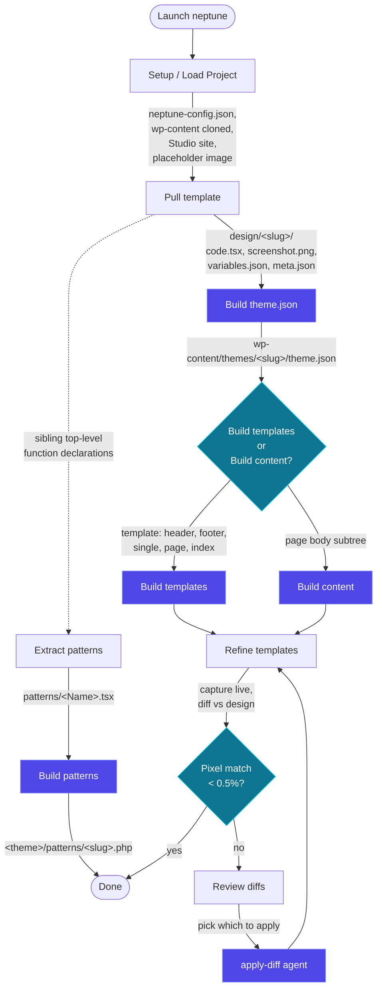
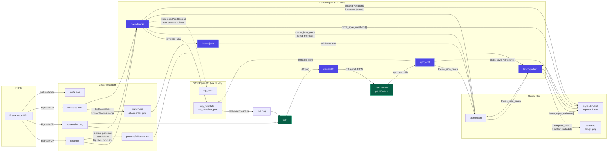

# Neptune

Neptune is an interactive CLI that turns Figma designs into working WordPress block themes. It pulls a page from Figma (Tailwind TSX + variables + screenshot), runs a local WordPress site under [Studio](https://developer.wordpress.com/studio/), and uses the Claude Agent SDK to convert each pull into Gutenberg block markup, a `theme.json`, and any block style variations the design needs. Refinements happen by capturing the live render, diffing it against the design, and applying only the differences.

The intent is to keep the human at the menu — Neptune drives Figma, the file system, the Studio site, and the agents. Failures stop early and surface in the UI, so a paid agent call only fires when its inputs are good.

## Install

```bash
git clone <this repo>
cd neptune
npm install
npm run build
node dist/cli.js
```

You'll also need:

- Studio for Mac/Windows running, with at least one site created (for local WP).
- Figma's MCP server enabled (the plugin pulls TSX, assets, dev notes via MCP).
- An Anthropic API key in your environment so the Claude Agent SDK can run.

## What it does

| Step | What you do | What Neptune does |
| --- | --- | --- |
| Setup / Load Project | Pick a folder, name the project, point at the WordPress repo | Initialises `neptune-config.json`, clones `wp-content`, creates the Studio site, uploads a placeholder image |
| Pull template | Paste a Figma node URL, pick the matching template file (`index.html`, `header.html`, …) | Asks Figma's MCP for `code.tsx`, `screenshot.png`, `variables.json`, dev notes; writes `design/<slug>/` |
| Build theme.json | — | Merges every pull's `variables.json` into `variables/all-variables.json`, then asks the `theme-json` skill to map tokens onto a block-theme `theme.json` |
| Build templates | Toggle off any pulls you don't want (every row starts checked) | For each selected pull, sends `code.tsx`, `theme.json`, variables, screenshot, dev notes, and the inventory of existing block style variations to the `tsx-to-blocks` skill; writes the resulting block markup into the `wp_template` / `wp_template_part` row. Building one template is the same flow with one row toggled — no separate single-template command. |
| Build content | Pick a pull flagged as `usesPostContent` | Same agent flow as Build templates, but converts only the `data-neptune-annotations="post-content"` subtree and writes it to a `wp_post` |
| Refine templates | Toggle off any pulls you don't want | For each selected pull, captures the live page in headless Chromium, diffs it against `screenshot.png` with [odiff](https://github.com/dmtrKovalenko/odiff), runs the `visual-diff` skill, then runs `apply-diff` to update the markup, `theme.json`, or block style variations. Auto-approves every diff the visual-diff agent reports. |
| Extract patterns | — | Walks every pull's `code.tsx` and copies non-default top-level functions into `patterns/<Name>.tsx` (first-write-wins on duplicates) |
| Build patterns | Deselect any patterns you don't want | For each selected `patterns/<Name>.tsx`, runs the `tsx-to-pattern` skill and writes a WordPress block pattern PHP file at `<theme>/patterns/<slug>.php`. The picker starts with everything checked. |
| Verify screenshots | — | Re-renders each design and re-captures so you know the source-of-truth screenshot still matches what Figma gives you |
| View template diff | Pick a pull | Re-runs only the capture+odiff step so you can inspect drift without paying for an agent call |

## User flow



The arrows are forward-only because each step is gated on the previous step's artefact landing on disk or in the database — `listPulls()` reads `design/<slug>/meta.json`, the menu reads `neptune-config.json`, and the build commands check for `themeSlug` before showing up.

## Architecture

Neptune is a small Ink (React-in-the-terminal) app that orchestrates four kinds of side effects: Figma MCP calls, file system writes, Studio's `wp-cli` MCP, and the Claude Agent SDK. Each command is a self-contained `runX(...)` async function — the React component is a thin shell around it.

```
source/
  app.tsx                       Top-level menu, project-state machine
  cli.tsx                       Entry point, argv parsing
  commands/
    setup-project/              Multi-step config wizard
    pull-template/              Figma node → design/<slug>/
    build-theme-json.tsx        variables → theme.json
    build-template.ts           Headless runBuild helper (used by build-templates.tsx)
    build-templates.tsx         Build templates picker UI — toggles a deselectable list, runs runBuild per row
    build-content.tsx           code.tsx body → wp_post
    refine-template.ts          Headless runDiagnose / runApply helpers
    refine-templates.tsx        Refine templates picker UI — capture + odiff + agent fixes per row
    extract-patterns.tsx        Reusable TSX patterns from pulls' code.tsx
    build-patterns.tsx          patterns/&lt;Name&gt;.tsx → &lt;theme&gt;/patterns/&lt;slug&gt;.php
  lib/
    agent-stream.ts             Claude Agent SDK driver
    build-envelope.ts           Validates JSON envelopes from agents
    theme-json-patch.ts         Reads/writes theme.json + block style variations
    patterns.ts                 Pattern slug + PHP file serialiser + envelope parser
    browser-capture.ts          Playwright headless capture
    odiff-runner.ts             Pixel diff
    template-diff.ts            Pad + diff orchestration
    wp-templates.ts, wp-pages.ts, wp-cli.ts   Studio MCP wrappers
    design-walk.ts              Pull discovery / metadata
    build-variables.ts          variables/* merge
    dev-annotations.ts          Designer notes extraction
    atomic-write.ts             tmp-file-then-rename writes
    lockfile.ts                 Per-project mutual exclusion
  integrations/
    figma/                      MCP session, asset download, handoff parser
    studio/                     MCP session, Studio site detection
    wordpress/                  WordPress install, wp-content clone
  plugins/neptune-tools/
    skills/
      tsx-to-blocks/SKILL.md    Source-of-truth prompt for the build agents
      tsx-to-pattern/SKILL.md   Source-of-truth prompt for the build-patterns agent
      apply-diff/SKILL.md       Source-of-truth prompt for the refine agent
      visual-diff/SKILL.md      Source-of-truth prompt for the diff agent
      theme-json/SKILL.md       Source-of-truth prompt for theme.json builder
```

Key invariants the codebase enforces:

- **Project state lives on disk, not in memory.** `neptune-config.json` is the source of truth for "what's been set up," and `design/<slug>/meta.json` is the source of truth for "what's been pulled." The menu reads these on every refresh; nothing is cached across runs.
- **Atomic writes everywhere.** Every file write goes through `lib/atomic-write.ts` (`writeFileAtomic`), which writes to a tmp file in the same directory and renames into place. A killed process never leaves a half-written `theme.json`.
- **One agent call per envelope.** Build and refine agents return a single JSON envelope with `template_html`, an optional `theme_json_patch`, and an optional `block_style_variations[]`. Neptune persists all three; the agent never calls `Write`/`Edit` itself.
- **Existing block style variations are inventoried and reused.** Before each build/refine, Neptune reads `<theme>/styles/blocks/*.json` and feeds the inventory to the agent. If a header and footer need the same alternate button style, they share one `is-style-neptune-<slug>` instead of registering it twice.
- **Studio is the only WP runtime.** Database writes go through Studio's `wp-cli` MCP (`lib/wp-cli.ts`); we never edit `wp_posts` rows directly. The cache is flushed after every `theme.json` mutation so changes show up on the next pageload.
- **Every paid path has a confirm-overwrite gate.** Build / refine commands check the database for an existing row first and prompt before overwriting, so a misclick can't burn an agent call you didn't mean to make.

## Data flow: Figma → blocks



Read it as four loops:

1. **Pull loop** — Figma MCP → `design/<slug>/` files. No agents involved; Neptune is just a smart download client. The slug comes from the page name, the `templateFile` mapping comes from the user's pick at pull time, and the `meta.json` carries everything downstream commands need so they don't have to re-ask Figma.

2. **Theme bootstrap** — every pull's `variables.json` merges into a single `variables/all-variables.json` (first-write-wins, conflicts logged), which feeds the `theme-json` skill. The output is a fully-formed block-theme `theme.json` with presets for color, typography, spacing, and layout. This happens once per project; subsequent pulls add new tokens by re-running.

3. **Build / refine loop** — each template runs `tsx-to-blocks` against `code.tsx` plus the current `theme.json`, the variables index, dev notes, the screenshot, and the existing variations inventory. The envelope it returns updates three things atomically: the database row for the template, `theme.json` (deep-merged into `styles.blocks` and `settings.custom` only), and `<theme>/styles/blocks/*.json` for new variations. Refine reuses the same envelope shape — only the prompt changes (it's the diff list instead of `code.tsx`).

4. **Pattern loop** — `extract-patterns` walks every `code.tsx` and copies non-default top-level functions into `patterns/<Name>.tsx` (first-seen wins on duplicates). `build-patterns` then runs `tsx-to-pattern` against each one and writes `<theme>/patterns/<slug>.php`. The PHP file's header comment is the registration metadata WordPress core auto-discovers at boot — `Title:`, `Slug:`, `Categories:`, `Block Types:`, `Viewport Width:`, `Inserter:`, `Description:`, `Keywords:`. The agent never emits PHP; Neptune wraps the block markup in the docblock header itself. Patterns share the same `theme.json` and block-style-variations inventory as the template build, so a button variation declared by a template is reused by a pattern instead of being duplicated.

## Styling priority

Both build and refine agents follow the same cardinal rule, codified in `tsx-to-blocks/SKILL.md` and `apply-diff/SKILL.md`:

1. A `theme.json` preset slug, when one already matches.
2. A pre-exposed structured property under `theme_json_patch.blocks["core/<x>"]` — color/typography/spacing/border/elements. Project-wide.
3. **Reuse** an existing block style variation by applying its `is-style-<slug>` class.
4. A new block style variation in `block_style_variations[]`, again using structured properties.
5. CSS, last resort — only when the rule cannot be expressed as a structured property (pseudo-selectors, descendant selectors, animations).

The agents see the existing variations inventory in their prompt, so option 3 actually fires — you don't get a duplicate `neptune-cta-fill` registered once for header.html and again for footer.html.

## Tests

```bash
npm test
```

Unit tests live under `test/unit/`. They cover the parsing and envelope-validation layers (`build-envelope`, `refine-template-parser`), the file-mutation primitives (`theme-json-patch`, `atomic-write`), the diff orchestration (`design-walk`, `template-scaffold`, `template-diff` helpers), and the WP wrappers' command shape (`wp-templates`, `wp-pages`, `wp-cli`). They deliberately don't try to spin up Studio or Figma — those are integration concerns and would be flaky in CI. The agent code paths are tested by mocking `runAgent` and feeding the parsers known envelope shapes.

## Configuration

Per-project state lives in `<project>/neptune-config.json`. The shape is in `source/commands/setup-project/types.ts`; the bits that matter to other commands are:

- `themeSlug` — the WP theme directory name. Required before build/refine.
- `placeholderImage` — `{id, url}` for an attachment uploaded during setup. Build agents are told to use this for every `wp:image` block so live renders don't flash empty `src`s.
- `steps` — boolean map of which setup steps have completed. The wizard resumes from the first `false`.
- `design.pagesDir` — the Figma file URL used as the source of pulls.

Per-pull state lives in `<project>/design/<slug>/meta.json` (`PullMeta` in `source/lib/types.ts`).
